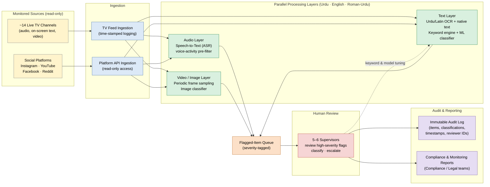

```mermaid
flowchart LR
    subgraph SRC["Monitored Sources (read-only)"]
        tv["~14 Live TV Channels<br/>(audio, on-screen text, video)"]
        sm["Social Platforms<br/>Instagram · YouTube<br/>Facebook · Reddit"]
    end

    subgraph ING["Ingestion"]
        ing_tv["TV Feed Ingestion<br/>(time-stamped logging)"]
        ing_sm["Platform API Ingestion<br/>(read-only access)"]
    end

    subgraph PROC["Parallel Processing Layers (Urdu · English · Roman-Urdu)"]
        audio["Audio Layer<br/>Speech-to-Text (ASR)<br/>voice-activity pre-filter"]
        text["Text Layer<br/>Urdu/Latin OCR + native text<br/>Keyword engine + ML classifier"]
        video["Video / Image Layer<br/>Periodic frame sampling<br/>Image classifier"]
    end

    queue["Flagged-Item Queue<br/>(severity-tagged)"]

    subgraph HUM["Human Review"]
        sup["5–6 Supervisors<br/>review high-severity flags<br/>classify · escalate"]
    end

    subgraph OUT["Audit & Reporting"]
        audit["Immutable Audit Log<br/>(items, classifications,<br/>timestamps, reviewer IDs)"]
        rep["Compliance & Monitoring Reports<br/>(Compliance / Legal teams)"]
    end

    tv --> ing_tv
    sm --> ing_sm

    ing_tv --> audio
    ing_tv --> text
    ing_tv --> video
    ing_sm --> audio
    ing_sm --> text
    ing_sm --> video

    audio --> queue
    text --> queue
    video --> queue

    queue --> sup
    sup --> audit
    sup --> rep
    sup -. "keyword & model tuning" .-> text

    classDef source fill:#FFF4CC,stroke:#888,color:#000
    classDef ingest fill:#DCE9F7,stroke:#4C78A8,color:#000
    classDef proc fill:#D9F0DF,stroke:#2E8B57,color:#000
    classDef flag fill:#FCE0C8,stroke:#C07A3A,color:#000
    classDef human fill:#F6D5D5,stroke:#C0504D,color:#000
    classDef out fill:#E6DDF3,stroke:#7B5EA7,color:#000

    class tv,sm source
    class ing_tv,ing_sm ingest
    class audio,text,video proc
    class queue flag
    class sup human
    class audit,rep out
```
